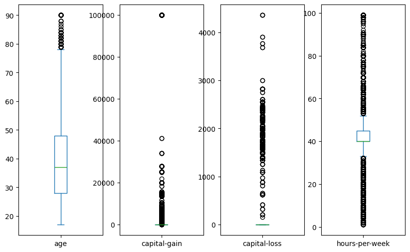
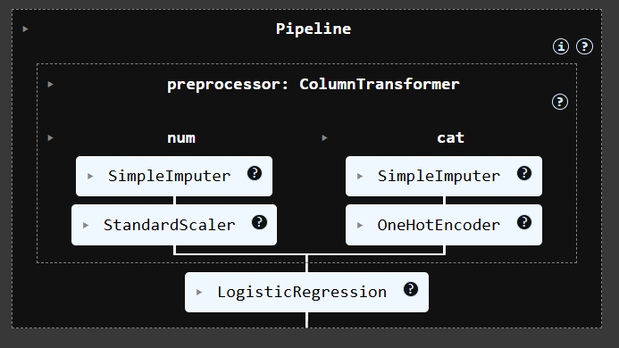
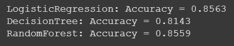
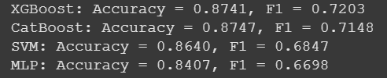
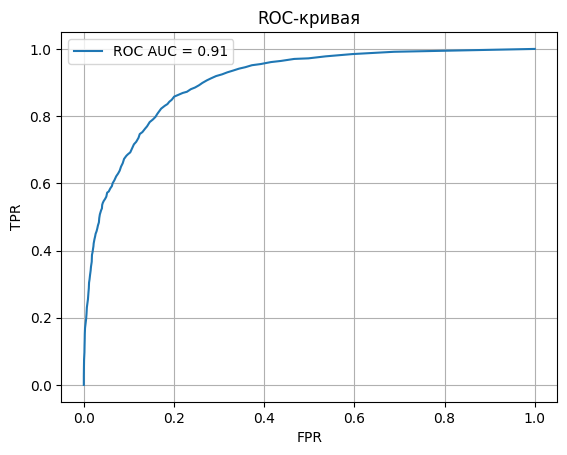
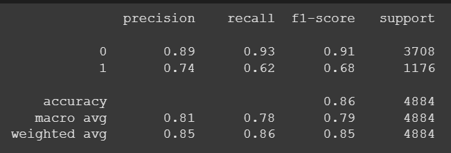

# Adult Census Income Classification

# Описание
Проект направлен на построение модели машинного обучения, способной предсказывать уровень дохода (>50K или <=50K) человека на основе данных переписи населения США (1994 год).

Источник: `https://archive.ics.uci.edu/dataset/2/adult`

# Структура проекта
project/
- [adult](adult.zip) - Исходные данные
- [model.pkl](model.zip) - Итоговая обученная модель
- [app.py](app.py) - JSON API с использованием Flask

templates/
- [index.html](index.html) - Веб-интерфейс (простая форма)
- [requirements.txt](requirements.txt) - Зависимости

notebooks/
- [Jupiter Notebook](adult_census_income_classification.ipynb)

# Этапы проекта
## 1. Исследование и подготовка данных
- Загрузка данных(adult.data, adult.test)
- Проверка на пропуски, выбросы, типы данных
- Визуализация: распределения, boxplot, countplot
  

- Преобразование категориальных признаков (OneHotEncoder, LabelEncoder)
- Масштабированием числовых признаков (StandardScaler)
- Стратифированное разделение на обучающую, валидационную и тестовую выборки

## 2. Обучение моделей
Baseline модели:
- DummyClassifire (most_frequent)
- Logistic Regression

- Decision Tree

Продвинутые модели:
- Ramdom Forest
- XGBoost
- CatBoost
- SVM (с ядрами)
- MLPClassifier (нейросеть)

## 3. Подбор гиперпараметров
- GridSearchCV
- RandomizedSearchCV

## 4. Оценка моделей
- Метрики: accuracy, precision, recall, f1-score, ROC AUC, log loss
- Визуализация:
- - confusion matrix
- - ROC/PR-кривые

- - обучение/валидация по эпохам (для MLP)

## 5. Интерпретация
- Shap-значения (TreeExplainer): визуализация важности признаков через beeswarm plot

## 6. Развертывание
- Сериализация модели (model.pkl)
- JSON API с /predict на Flask
- WEB UI: HTML-форма с отправкой признаков и выводом предсказания

# Использование
## Локальный запуск:
`pip install -r requirements.txt
python app.py
`

Перейти в браузере на: `http://localhost:5000/`

Пример запроса к API:

